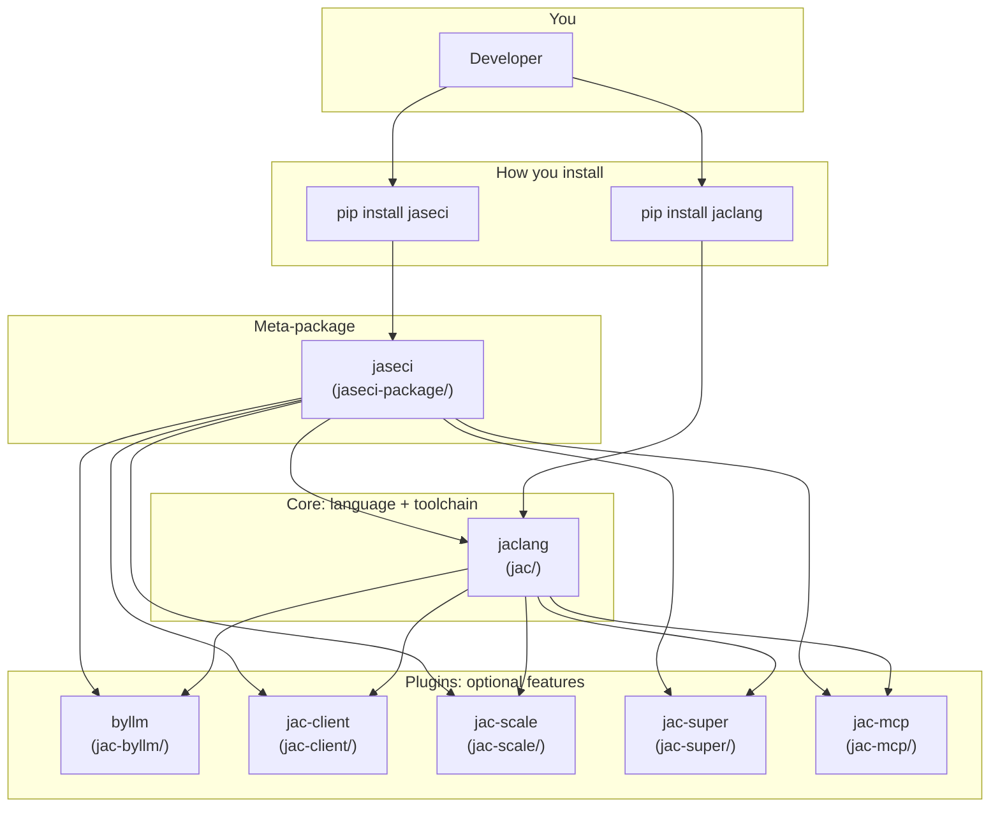

# Repository architecture map

This page is a **visual and tabular map** of how Jaseci repositories and commands fit together. For narrative detail see [Jaseci ecosystem overview](jaseci-ecosystem-overview.md) and the [Codebase Guide](../codebase-guide.md).

---

## One-sentence mental model

**Jac / `jaclang`** is the language + compiler + `jac` command + LSP. **Jaseci** is the **bundle** that adds optional plugins (LLMs, web UI, cloud, MCP, nicer CLI) on top of `jaclang`.

---

## Dependency / install map

Arrows mean **depends on / extends** — plugins register into and extend the core CLI and runtime.

---

## Folder map (plain language)

| Folder | Role |
|--------|------|
| `jac/` | **Jac language**: compiler, runtime, `jac` CLI, language server — the **engine**. |
| `jac-byllm/` | **AI models in code** — LLMs integrated into Jac. |
| `jac-client/` | **Browser / full-stack** — npm/React-style frontends with your Jac app. |
| `jac-scale/` | **Production deployment** — API, scaling, Redis/Mongo/K8s-style helpers. |
| `jac-super/` | **Terminal UX** — Rich output (quality of life, not language semantics). |
| `jac-mcp/` | **Editor and AI assistants** — MCP server for format, validate, Jac-aware tooling. |
| `jac-plugins/` | **Extra plugins** (e.g. UI kits), not required for the minimal core. |
| `jaseci-package/` | **`pip install jaseci`** — lists dependencies so one install pulls the stack. |
| `docs/` | **Documentation** site (MkDocs) and assets. |
| Root `pyproject.toml` | **Dev/tooling** convenience (e.g. pre-commit, local `jac` entry), not the full product definition. |

---

## Inside `jac/` (three layers)

Think of the core repo as:

1. **Front of the compiler** — parse Jac → internal IR (`jac0core/`: lexer/parser, AST/IR passes).
2. **Back of the compiler** — lower IR to **Python**, **JS**, or **native** (`compiler/passes/…`).
3. **Runtime and tools** — run code, serve APIs, watch files (`runtimelib/`), **CLI** (`cli/`), **LSP** (`lsp/`).

Same **`.jac` source** → multiple **targets** + shared **runtime and tooling**.

---

## Commands vs packages

| You run | Roughly involves |
|---------|------------------|
| `jac run` / `jac start` | **`jaclang`** core (+ enabled plugins). |
| LLM features in source | **`byllm`** (installed and configured). |
| JSX / web bundling | **`jac-client`**. |
| `jac start … --scale` | **`jac-scale`** (and its infrastructure assumptions). |
| Fancy logs | **`jac-super`**. |
| Jac help via MCP in the IDE | **`jac-mcp`**. |

---

## Choosing what to read next

| Goal | Read first |
|------|------------|
| Learn the language as a user | Tutorials and reference in this docs site. |
| Contribute to the compiler or runtime | [Codebase Guide](../codebase-guide.md). |
| Search the repo efficiently (including AI agents) | [Codebase search for agents](codebase-search-for-agents.md). |
